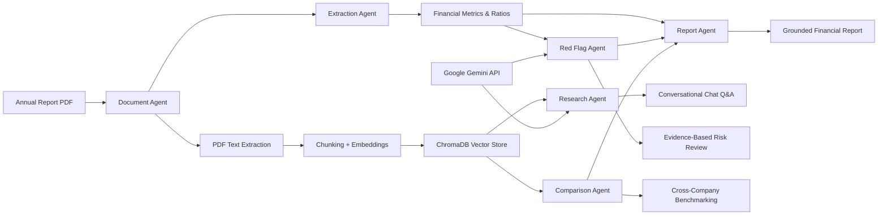

# Financial Multi-Agent System

A financial research and risk-analysis multi-agent system for annual-report PDFs. It stores document chunks in ChromaDB and uses Google Gemini API agents for extraction, research, red-flag analysis, cross-company benchmarking, and report generation using LangGraph, FastAPI, and Streamlit.

## Milestone Status

Status: Complete (Powered by Google Gemini API)

This project has successfully implemented all 7 Milestone 3 requirements:

- **Red Flag Agent**: Automated detection of rising debt, falling profit margins, revenue decline, net profit decline, auditor qualifications, and unusual financial patterns with Google Gemini reasoning.
- **Multi-Agent Orchestration Layer**: LangGraph workflow chaining Document Agent ➜ Extraction Agent ➜ Red Flag Agent with shared state and graceful error handling.
- **Testing & Validation**: End-to-end verification covering agents, LangGraph workflow, FastAPI endpoints, and source faithfulness guarantees.
- **Research Agent**: Multi-part question decomposition, ChromaDB vector retrieval using SentenceTransformers, fact extraction, and Google Gemini synthesized answers with verifiable citations.
- **Comparison Agent**: Cross-company metric benchmarking across 10 financial metrics, side-by-side Markdown tables, and safe missing-value handling (`N/A`).
- **Conversational Research Interface**: Interactive Streamlit UI with `st.chat_input` and `st.chat_message`, presenting reasoned answers, evidence bullet points, and source citations.
- **Initial Report Agent**: Grounded report synthesis featuring Executive Summary, Key Financials, Red Flags, Peer Comparison, Research Findings, and Sources.

## Work Diagram



## Architecture Overview

```text
Annual Report PDF Upload
        ↓
Document Agent (Text Extraction + Chunking + all-MiniLM-L6-v2 Embeddings)
        ↓
ChromaDB Persistent Vector Storage
        ↓
Extraction Agent (10 Core Metrics + Ratios + Comparative Periods)
        ↓
Red Flag Agent (Risk Signals + Auditor Language + Pattern Detection)
        ↓
LangGraph Workflow Orchestration
        ↓
Research Agent ──┬── Comparison Agent
                 ↓
      Report Agent (Executive Summary + Key Financials + Sources)
                 ↓
Streamlit Conversational UI (Chat + Pipeline Viewer + Benchmarking + Reports)
```

## ✅ Completed Features

- [x] Studied financial document structures & finalized multi-agent architecture
- [x] Implemented Document Agent with PDF parsing, text chunking, and ChromaDB vector indexing
- [x] Implemented Extraction Agent for 10 core financial metrics & ratios (Revenue, Net Profit, Operating Profit, Total Assets, Total Liabilities, Debt, EPS, Profit Margin, ROE, ROA)
- [x] Added comparative prior-period extraction and YoY revenue trend calculations
- [x] Implemented Red Flag Agent for rising debt, falling margins, revenue decline, profit decline, auditor qualifications, and unusual patterns
- [x] Integrated Google Gemini API for deep financial reasoning and risk analysis
- [x] Implemented Multi-Agent Orchestration using LangGraph StateGraph (`DocumentAgent` ➜ `ExtractionAgent` ➜ `RedFlagAgent`)
- [x] Implemented Research Agent with multi-part query decomposition, semantic search, and grounded chunk citations
- [x] Implemented Comparison Agent for cross-company financial benchmarking with Markdown tables
- [x] Implemented initial Report Agent with Executive Summary, Key Financials, Red Flags, Comparison, and Sources
- [x] Implemented Conversational Research UI in Streamlit with `st.chat_input` and `st.chat_message`
- [x] Built FastAPI REST endpoints (`/upload`, `/research`, `/compare`, `/report`, `/companies`, `/documents`, `/health`)
- [x] Enforced Source Faithfulness: strictly returns `N/A` or `"No supporting information was found in the indexed documents."` without hallucinating numbers
- [x] Validated full end-to-end workflow on seed annual-report PDFs
- [x] Completed all Milestone 3 requirements

## 🔄 Current Focus

- [ ] Additional PDF edge-case validation across diverse accounting layouts
- [ ] UI polish and styling refinements

## 📋 Upcoming Enhancements

- [ ] Advanced graphical chart generation for multi-year trends
- [ ] Direct PDF export for synthesized financial research reports
- [ ] End-to-end performance optimization

---

## ⚙️ Installation & Setup

### 1. Clone the Repository

```bash
git clone https://github.com/Sp-4030/Financial_Multi_Agent.git
cd Financial_Multi_Agent
```

### 2. Create a Virtual Environment

```bash
python -m venv .venv
```

Activate it:

Windows:

```bash
.venv\Scripts\activate
```

Linux / macOS:

```bash
source .venv/bin/activate
```

### 3. Install Dependencies

```bash
pip install -r requirements.txt
```

### 4. Configure Google Gemini API Key

Create a `.env` file in the project root directory and set your Gemini API key:

```env
GEMINI_API_KEY=your_gemini_api_key_here
GEMINI_MODEL=gemini-3.8-flash
```

Get your free Gemini API key from [Google AI Studio](https://aistudio.google.com/).

### 5. Run the Backend (FastAPI)

From the project root:

```bash
python -m uvicorn backend.main:app --reload
```

Access:

```text
http://127.0.0.1:8000
```

FastAPI Interactive Docs (Swagger UI):

```text
http://127.0.0.1:8000/docs
```

### 6. Run the Frontend (Streamlit)

Open a second terminal, activate the virtual environment, and run:

```bash
python -m streamlit run frontend/app.py
```

Access:

```text
http://localhost:8501
```

Or on Windows, launch both backend and frontend together using:

```cmd
run_app.cmd
```

### 7. Verify the Setup

Check the backend health:

```text
http://127.0.0.1:8000/health
```

Expected response:

```json
{
  "status": "ok",
  "milestone": "3"
}
```

Open the frontend:

```text
http://localhost:8501
```

---

## Project Workflow

Once the app is running, the typical flow is:

```text
Upload Annual Report PDF
        ↓
Document Agent (Text Extraction + Chunking + Embeddings)
        ↓
Store in ChromaDB Vector Database
        ↓
Extraction Agent (Extract 10 Core Metrics & Ratios)
        ↓
Red Flag Agent (Analyze Risks, Auditor Language & Patterns)
        ↓
Research / Comparison Agent (Multi-Part Q&A or Peer Benchmarking)
        ↓
Report Agent (Synthesize Executive Summary + Key Financials)
        ↓
Streamlit Conversational UI (Answer + Evidence + Sources)
```

## Notes

- The system runs using ChromaDB vector database, SentenceTransformers (`all-MiniLM-L6-v2`) embeddings, and Google Gemini API (`gemini-3.8-flash`) for deep financial reasoning and risk analysis.
- The workflow enforces source faithfulness: answers and evidence are strictly tied to indexed PDF chunks, and unsupported figures are never fabricated.
- Older or incompatible local database files may cause errors after changing database dependencies. If this happens, stop the application and remove the `vector_db/` folder and `research.db` file, then restart the application to create fresh databases. Back up these files first if you need to keep existing data.
