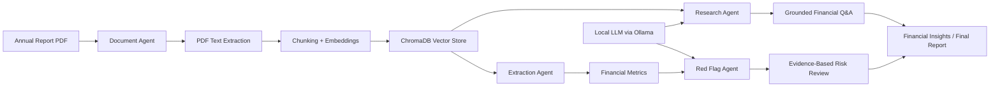

# Financial Multi-Agent System

A local financial research and risk-analysis system for annual-report PDFs. It stores document chunks in ChromaDB and uses local LLM agents for extraction, research, and red-flag analysis without depending on external cloud services.

## Milestone 3 Status

Status: Complete

This project has successfully completed Milestone 3 for the local financial multi-agent workflow, including:

- PDF ingestion and indexing
- company-aware research retrieval
- evidence-based red-flag analysis
- end-to-end validation using seeded annual-report documents

## Work Diagram



## Architecture Overview

```text
Annual Report PDF
        ↓
Document Agent
        ↓
PDF Text Extraction
        ↓
Chunking + Embeddings
        ↓
ChromaDB Storage
        ↓
Research + Extraction + Red-Flag Agents
        ↓
LangGraph Workflow
        ↓
Financial Analysis + Risk Review
        ↓
Final Report / Insights
```

## ✅ Completed Features

- [x] Studied financial document structures
- [x] Finalized system architecture
- [x] Designed multi-agent responsibilities
- [x] Implemented document ingestion and metadata handling
- [x] Implemented PDF extraction
- [x] Implemented text chunking and embedding generation
- [x] Integrated ChromaDB vector database
- [x] Implemented multi-document indexing
- [x] Added company-aware retrieval logic
- [x] Implemented extraction agent for financial metrics
- [x] Implemented financial ratio calculation
- [x] Fixed false-positive red-flag classification logic
- [x] Improved evidence-based research filtering
- [x] Validated workflow on seeded annual-report PDFs
- [x] Completed Milestone 3 requirements

## 🔄 Current Focus

- [ ] Formal milestone regression test suite
- [ ] Additional PDF edge-case validation
- [ ] UI polish and reporting improvements

## 📋 Upcoming Enhancements

- [ ] Report agent enhancements
- [ ] Company comparison module
- [ ] Automated report generation
- [ ] Final Streamlit experience refinements
- [ ] End-to-end optimization and validation

---

## ⚙️ Installation & Setup

### 1. Clone the Repository

```bash
git clone https://github.com/Sp-4030/Financial_Multi_Agent.git
cd Financial_Multi_Agent
```

### 2. Create a Virtual Environment

```bash
python -m venv .venv
```

Activate it:

Windows:

```bash
.venv\Scripts\activate
```

Linux / macOS:

```bash
source .venv/bin/activate
```

### 3. Install Dependencies

```bash
pip install -r requirements.txt
```

### 4. Run the Backend

From the project root:

```bash
python -m uvicorn backend.main:app --reload
```

Access:

```text
http://127.0.0.1:8000
```

### 5. Run the Frontend

Open a second terminal and run:

```bash
streamlit run frontend/app.py
```

Access:

```text
http://localhost:8501
```

### 6. Verify the Setup

Check the backend:

```text
http://127.0.0.1:8000
```

Expected response:

```json
{
  "status": "ok"
}
```

Open the frontend here:

```text
http://localhost:8501
```

---

## Project Workflow

Once the app is running, the typical flow is:

```text
Upload Annual Report PDF
        ↓
Extract text from PDF
        ↓
Chunk text into sections
        ↓
Generate embeddings
        ↓
Store in ChromaDB
        ↓
Run vector search
        ↓
Analyze extracted metrics
        ↓
Perform red-flag review
        ↓
Generate grounded financial insight
```

## Notes

- The system is designed to work locally with Ollama and ChromaDB.
- It is intended for document-grounded financial research and risk analysis.
- The workflow is optimized to keep answers tied to the source PDFs rather than relying on generic external knowledge.
- Older or incompatible local database files may cause errors after changing or upgrading database dependencies. If this happens, stop the application and remove the `vector_db/` folder and `research.db` file, then restart the application to create fresh databases. This permanently deletes indexed documents and saved research records, so back up these files first if you need to keep that data. Re-upload your PDFs after the databases are recreated.
