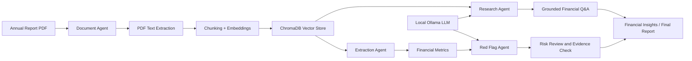

# Financial Multi-Agent System

A local financial research and risk-analysis system that processes annual-report PDFs, stores document chunks in ChromaDB, and uses local LLM agents for extraction, research, and red-flag analysis.

## 🚧 Current Development Status

Project is currently under active development as part of the **Infosys Springboard Virtual Internship**.

## 📊 Work Diagram



## 📊 Current Pipeline

```text
Financial PDF Scraping    ✅
      ↓
PDF Text Extraction       ✅
      ↓
Text Chunking             ✅
      ↓
Embeddings                ✅
      ↓
ChromaDB                  ✅
      ↓
Vector Search             ✅
      ↓
Research Session          ✅
      ↓
Document Agent            ✅
      ↓
Extraction Agent          ✅
      ↓
LangGraph Workflow        ✅
      ↓
Financial Analysis        ✅
      ↓
Financial Insights        ✅
      ↓
Final Report              ✅


### ✅ Completed

- [x] Studied financial document structures
- [x] Finalized initial system architecture
- [x] Designed multi-agent architecture and agent responsibilities
- [x] Implemented Research Workspace
- [x] Implemented Research Session Management
- [x] Implemented PDF document upload
- [x] Implemented PDF text extraction
- [x] Implemented text chunking
- [x] Implemented embedding generation
- [x] Integrated ChromaDB vector database
- [x] Implemented multi-PDF ingestion
- [x] Added company/document metadata
- [x] Implemented unique IDs for document chunks
- [x] Successfully indexed multiple financial documents into ChromaDB
- [x] Implemented semantic/vector search foundation
- [x] Implemented Extraction Agent
- [x] Implemented extraction of key financial metrics
- [x] Implemented financial ratio calculation
- [x] Fixed false-positive red-flag classification logic
- [x] Improved company-aware research retrieval
- [x] Validated workflow on seeded annual-report PDFs

### 🔄 Currently Working On

- [ ] Formal milestone regression test suite
- [ ] Additional PDF edge-case validation
- [ ] UI polish and final reporting improvements

### 📋 Upcoming

- [ ] Report Agent enhancements
- [ ] Company comparison module
- [ ] Automated report generation
- [ ] Complete Streamlit interface integration
- [ ] End-to-end testing and optimization

---
## ⚙️ Installation & Setup

### 1. Clone the Repository

```bash
git clone https://github.com/Sp-4030/Financial_Multi_Agent.git
cd Financial_Multi_Agent
```

### 2. Create a Virtual Environment

```bash
python -m venv venv
```

Activate the virtual environment:

**Windows:**

```bash
venv\Scripts\activate
```

**Linux / macOS:**

```bash
source venv/bin/activate
```

### 3. Install Dependencies

```bash
pip install -r requirements.txt
```

### 4. Run the Backend

From the project root directory:

```bash
python -m uvicorn backend.main:app --reload
```

Backend will run at:

```text
http://127.0.0.1:8000
```

### 5. Run the Streamlit Frontend

Open another terminal, activate the virtual environment, and run:

```bash
streamlit run frontend/app.py
```

Frontend will run at:

```text
http://localhost:8501
```

### 6. Project Workflow

Once both backend and frontend are running:

```text
Upload Financial PDF
        ↓
PDF Text Extraction
        ↓
Text Chunking
        ↓
Embedding Generation
        ↓
ChromaDB Indexing
        ↓
Vector Search
        ↓
Document Agent
        ↓
Extraction / Analysis Agents
        ↓
LangGraph Workflow
        ↓
Financial Insights
        ↓
Final Report
```

### 8. Verify Installation

Check that the backend is running:

```text
http://127.0.0.1:8000
```

You should receive:

```json
{
    "status": "ok"
}
```

Then open the Streamlit application:

```text
http://localhost:8501
```

