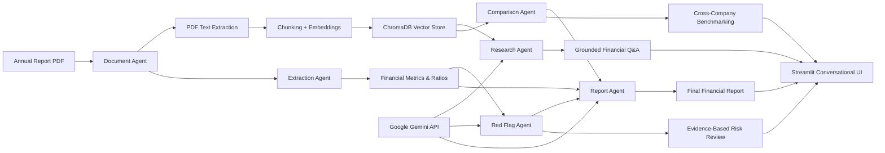
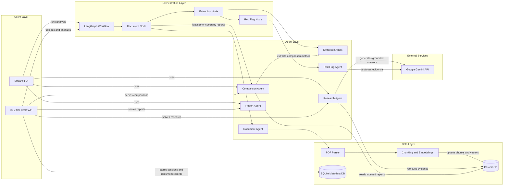

# Financial Multi-Agent System

A local financial-report research application for PDF annual reports. It uses
SentenceTransformers to create embeddings, ChromaDB for persistent semantic
retrieval, SQLite for API upload/session metadata, LangGraph to orchestrate
document analysis, Streamlit for the user interface, FastAPI for REST access,
and Google Gemini for source-grounded research and contextual risk analysis.

The agents do not establish audited facts: extracted values are pattern-based,
and annual-report layouts vary. Review every extracted metric and potential
finding against the cited source document. Unsupported values remain `N/A` or
`null`; a research answer is not generated without retrieved evidence.

## Work Diagram



## Low-Level Design

The application has two entry points: the Streamlit UI invokes the workflow and
agents directly, while the FastAPI service exposes REST endpoints for uploads,
research, comparison, and reports. Both entry points share the financial
workflow, agents, and persistent ChromaDB collection.

<!-- Mermaid checked: safe labels, quoted arrow labels, unique node IDs, and all subgraphs closed. -->


### Component Inventory

| Component | Layer | Type | Responsibility |
|---|---|---|---|
| Streamlit UI | Client | Web interface | Accepts PDFs and presents extracted metrics, risk findings, research answers, comparisons, and reports. |
| FastAPI REST API | Client/API | REST service | Validates requests and provides health, configuration, session, document, upload, research, comparison, and report endpoints. |
| LangGraph Workflow | Orchestration | State graph | Runs document processing, metric extraction, and red-flag analysis in sequence using shared workflow state. |
| Document Agent | Agent | Ingestion | Extracts PDF text, chunks and embeds it, and upserts chunks with company and document metadata into ChromaDB. |
| Extraction Agent | Agent | Metric extraction | Extracts financial metrics and ratios from report text; also supplies metrics for company comparisons. |
| Red Flag Agent | Agent | Risk analysis | Evaluates report evidence, extracted metrics, and prior-period metrics; uses Gemini for contextual reasoning. |
| Research Agent | Agent | Retrieval-augmented research | Retrieves relevant ChromaDB chunks and generates answers with source evidence using Gemini. |
| Comparison Agent | Agent | Benchmarking | Groups indexed report chunks by company and compares extracted financial metrics. |
| Report Agent | Agent | Report synthesis | Builds source-grounded report sections from provided metrics and red-flag findings. |
| PDF Parser | Data processing | Utility | Extracts text from uploaded annual-report PDFs. |
| Chunking and Embeddings | Data processing | Utilities | Splits extracted text and creates vectors for semantic retrieval. |
| ChromaDB | Persistence | Vector store | Persists report chunks, embeddings, and metadata used by ingestion, research, and comparison. |
| SQLite Metadata DB | Persistence | Relational database | Stores research sessions and uploaded-document metadata for the FastAPI service. |
| Google Gemini API | External service | LLM API | Provides language-model reasoning for research answers and red-flag analysis. |

### Data Storage and External Services

ChromaDB persists indexed document chunks and embeddings in `vector_db/`;
SentenceTransformers (`all-MiniLM-L6-v2`) creates embeddings. SQLite persists
research sessions and document records in `research.db`. Research and risk
analysis call Google Gemini using the configured API key and model.

### Key Design Decisions

- LangGraph makes PDF analysis a sequential, stateful workflow: document
  ingestion, metric extraction, then red-flag analysis.
- The Streamlit UI and FastAPI API are separate application entry points that
  reuse shared workflow and agent code.
- Research is grounded in retrieved report chunks; ChromaDB metadata supports
  company-level filtering, comparison, and citations.

## Agent responsibilities

| Component | Responsibility |
| --- | --- |
| Document Agent | Extract PDF text, split it into chunks, generate embeddings, and upsert chunks and company/document/year metadata. |
| Extraction Agent | Extract reported revenue, net and operating profit, assets, liabilities, debt, EPS and financial year; calculate profit margin, ROE and ROA only when required inputs exist. |
| Red Flag Agent | Review available statement comparisons, financial ratios, auditor opinions, going-concern statements and other risk language with nearby source evidence. |
| Research Agent | Classify concepts, report research, extraction, comparisons, trends, calculations, risk review, summaries and report requests; retrieve separately for named companies; retain short follow-up context; and return citations or retrieved excerpts when Gemini is unavailable. |
| Comparison Agent | Group indexed chunks by document and compare extracted metrics across companies and financial years. |
| Report Agent | Assemble executive summary, extracted metrics, risk findings, optional research answers, comparison data and source documents without inventing missing values. |
| LangGraph workflow | Run document ingestion, extraction, risk review and report generation in order. |

## Requirements

- Windows, macOS or Linux
- Python 3.10 or newer
- A Google Gemini API key for LLM-backed research and contextual risk analysis
- Internet access on first embedding-model use to download the configured model

The app can ingest PDFs, extract metrics, compare indexed financial figures and
generate deterministic report sections without a Gemini key. Gemini-dependent
features report a configuration error when the key is missing.

## Installation and configuration

From the project root:

```powershell
python -m venv .venv
.\.venv\Scripts\Activate.ps1
python -m pip install --upgrade pip
pip install -r requirements.txt
Copy-Item .env.example .env
```

`.env.example` is a tracked template containing placeholder values. After
copying it, replace the placeholder with your actual Gemini API key in `.env`.
The `.env` file is ignored by Git; never commit or share it.

```dotenv
GEMINI_API_KEY=your_google_ai_studio_key
GEMINI_MODEL=gemini-2.5-flash
```

`GOOGLE_API_KEY` is also accepted by the client. `GEMINI_MODEL` is optional;
the application default is `gemini-2.5-flash`, and the model must be enabled
for your Google AI account. The service uses Google's
`google-genai` client; Ollama is not the configured LLM provider.

Optional local data path overrides can be set in `.env`:

```dotenv
FINANCIAL_DB_PATH=research.db
CHROMA_DB_PATH=vector_db
FINANCIAL_UPLOAD_DIR=data/uploads
EMBEDDING_MODEL=all-MiniLM-L6-v2
```

Relative paths resolve from the project root. The defaults preserve the
existing `research.db`, `vector_db/` and `data/uploads/` locations. These may
contain private financial documents or metadata and are ignored by Git. Back
them up before manually changing or moving them; the application does not
delete them.

## Run the application

Run the FastAPI service and Streamlit UI in separate terminals from the
project root after activating `.venv`:

```powershell
python -m uvicorn backend.main:app --reload --host 127.0.0.1 --port 8000
```

```powershell
python -m streamlit run frontend/app.py --server.address 127.0.0.1 --server.port 8501
```

Open <http://127.0.0.1:8501> for the Streamlit application,
<http://127.0.0.1:8000/docs> for interactive API documentation, or
<http://127.0.0.1:8000/health> to check backend status.

On Windows, `run_app.cmd` opens separate backend and frontend console windows.
The first PDF processing run may take longer while the embedding model loads.

The Streamlit interface is organized into Dashboard, Research Chat, Company
Comparison, Reports, and Indexed Documents pages, with upload controls and
service status in the sidebar. Dashboard counts and document lists come from
the local ChromaDB index; recent research activity is shown only for the
current Streamlit session. Each long-running action displays a native
processing status while its agent call is active. Research Chat reports live
workflow steps from the research agent; steps that do not apply are marked as
skipped. Comparison, report generation and PDF processing also show progress
at their actual processing stages. Successful requests display their results
and citations, while failures display an error. Chat's supporting-document
summary lists each company/document once rather than repeating every retrieved
chunk; individual research findings retain their source citations. The UI uses
a consistent light theme and can run standalone: the FastAPI health status is
shown separately and is not required for direct agent access from Streamlit.

Upload a PDF in the sidebar. The UI saves it under the configured upload
directory, displays workflow progress, then shows extracted metrics and risk
findings. Research chat routes educational financial definitions without
requiring a report; company-specific questions use indexed evidence.
It supports multi-intent requests and follow-ups, company/document filters,
comparisons, trend views, calculations, evidence-based risk review, summaries
and report requests. When a cited Gemini response cannot be produced, the
system shows retrieved excerpts and source metadata instead of inventing an
answer. Comparison values retain their extracted representation; units that
cannot be identified are marked as unavailable/not normalized, and reporting
period differences are called out. The standalone comparison and report tabs
remain available independently of chat. The report tab extracts metrics from
the selected indexed document, runs risk review against its indexed text, and
includes explicit missing-information and limitation notes.

## FastAPI endpoints

| Method | Endpoint | Description |
| --- | --- | --- |
| `GET` | `/health` | Backend status, configured provider/model and key-presence status (never returns the key). |
| `POST` | `/sessions` | Create a document-upload session. Body: `{"name":"Research"}`. |
| `GET` | `/sessions` | List upload sessions. |
| `POST` | `/upload?session_id=1` | Upload, validate and analyze a PDF; maximum file size is 50 MiB. |
| `GET` | `/documents` | List uploaded document records; optional `session_id` and `company` filters. |
| `GET` | `/companies` | List company names from indexed ChromaDB documents. |
| `POST` | `/research` | Route a natural-language request. Body accepts `query`, optional `top_k` (1-20), `company`, `document_id` and up to 20 `conversation_history` messages. Concepts work without Gemini; document questions use indexed evidence and cite sources or return source excerpts if Gemini is unavailable. |
| `POST` | `/compare` | Compare indexed documents. Body: `{"companies":["Company A","Company B"]}`; omit the list to include all companies. |
| `POST` | `/report` | Assemble report sections from supplied metrics, risk findings, comparisons, research findings and sources. |
| `GET`, `POST` | `/config` | Read non-secret model configuration or update the in-process Gemini key/model. Prefer `.env` for local configuration. |

FastAPI validates malformed requests with standard `422` responses. Upload
errors return appropriate client errors for missing sessions, non-PDF files,
empty files, oversized files or unreadable PDFs. LLM and internal service
failures are reported explicitly; detailed unexpected exceptions are logged
server-side rather than returned to clients.

```powershell
python -m pytest -q test_financial_agents.py test_service_contracts.py
```

Question routing and conversation behavior are covered separately:

```powershell
python -m pytest -q test_question_handling.py
```

The focused unit tests use an in-memory vector collection and mock LLM calls;
the service-contract tests use a temporary SQLite database and mocked Gemini
response. They do not contact Gemini or alter the existing database/vector
index. The script-style `Test_extraction_agent.py`,
`Test_red_flag_agent.py`, `Test_workflow.py` and `Test_research_agent.py`
depend on real PDF processing, persistent ChromaDB and/or Gemini. Run those
only when you intend to use the real integrations and their local data.

## Limitations and troubleshooting

- Extraction uses document-label/number patterns, not a financial-statement
  OCR/table understanding model. Image-only/scanned PDFs without extractable
  text are rejected; missing or ambiguous numbers remain `null`.
- A financial year is inferred from explicit `FY`/financial-year text when
  available. If it cannot be found, comparison displays `N/A`.
- Multi-period red flags compare against the most recently indexed document
  for the same inferred company, not necessarily the immediately preceding
  financial year. Review the cited values and document names.
- ROE is calculated only when shareholder equity is extracted. Debt and other
  values preserve their source representation and units; comparisons across
  different currencies/reporting units therefore need human review.
- Google Gemini API availability, model access, quotas and network access are
  required for research answers and contextual LLM analysis. Add
  `GEMINI_API_KEY` to `.env` and verify `GEMINI_MODEL` is enabled for your key.
- ChromaDB and the SQLite database are local persistent stores. If a store
  reports a compatibility or corruption error, stop the app and back up the
  named data directory/file before considering recovery; do not delete them
  without confirming that the stored data is disposable.
- Check that the virtual environment is active, `pip install -r
  requirements.txt` completed, and ports 8000/8501 are available if either
  service fails to start.
